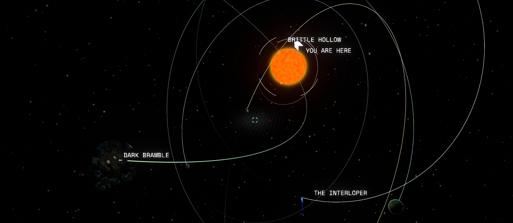

# Randomizer Mod by Pacific Engine

## Installing the Mod
1) Download and install https://outerwildsmods.com/
1) From the Application, Install `PacificEngine's Common Resources` by `PacificEngine`
1) From the Application, Install `Randomizer` by `PacificEngine`

## Using the Mod
### Configurable in Settings
| Value | Description |
| :-: | --- |
Seed | Takes any number or characters and generates a level based upon the value. Empty will just use a random seed.
Eye Coordinates | Choose to randomizes the eye coordinates
Dark Bramble Portals | Choose to randomize the maze of dark bramble

### Different Types of Randomness
| Value | Description |
| :-: | --- |
Off | As the developers original intended
Seed | Use the seed provided
Profile | Makes the seed different between profiles
Death | Makes the seed different between deaths
Minute | Makes the seed different between minutes since start of level
Upon Use | When an object is used, generate a new seed value from the original seed value
Seedless | Use a random seed
Seedless Minute | Use a new random seed every minute
Seedless Upon Use | When an object is used, use a new random seed

## Creating Code
Create a new file called `PacificEngine.OW_Randomizer.csproj.user`
```text/xml
<?xml version="1.0" encoding="utf-8"?>
<Project ToolsVersion="Current" xmlns="http://schemas.microsoft.com/developer/msbuild/2003">
  <PropertyGroup>
    <OuterWildsRootDirectory>$(OuterWildsDir)\Outer Wilds</OuterWildsRootDirectory>
    <OuterWildsModsDirectory>%AppData%\OuterWildsModManager\OWML\Mods</OuterWildsModsDirectory>
  </PropertyGroup>
</Project>
```
